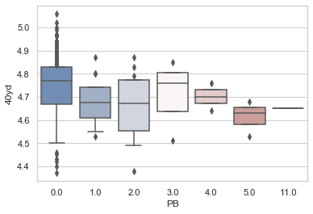
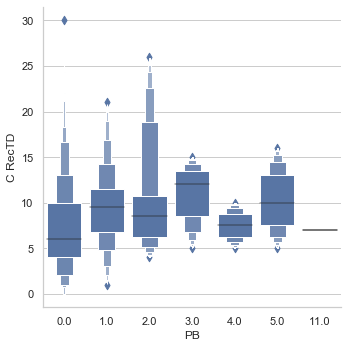

# Data Science Player Success Predictor
* Created a tool that estimates whether a player will become a pro-bowl caliber prospect based off of college statistics and combine results
* Scraped over a thousand current NFL players from websites using selenium and beautiful soup
* Engineered features to find which college/combine statistics best determine a players likelihood to become a pro-bowler

## Code and Resources Used
**Python Version:** 3.5  
**Packages:** pandas, numpy, sklearn, matplotlib, seaborn, selenium, beatiful soup
## Web Scraping
By navigating to data/collecting_data you will find the web scrapers we used in order to collect 65 features from profootballreference.com. Some of the features we scraped that included college statistics were:
8 College Games Played	
* College Receptions
* College Receiver Yards	
* College Receiver Average	
* College Receiver Touch Downs	
* College Rushing Attempts	
* College Rushing Yards	
* College Rushing Average	
* College Rushing Touch Downs	
* College Scrimage Plays	

Some features we scraped that included combine statistics were:
* Position
* School	
* Weight	
* 40 Yard Time 
* Vertical	
* Bench	
* Broad Jump

For the complete list of features [check out the complete data frame](https://github.com/DataScience-Proj-MH/NFL_Success/blob/master/Data/final_df.csv)

## Data Cleaning
After scraping the data, we cleaned the data so it was usable for our model.

*	Parsed the players by name to remove unnecessary characters
*	Split Round, Year, and Pick into unique features 
*	Removed players who were never drafted
* Removed players who did not have a record of college statistics	 
*	Merged various years of a player's college statistics and combine results to fit in a single row
*	Merged a players NFL statistics with their college and combine statistics 
*	Transformed founded date into age of company 

## EDA
Our main concern was the different statistical significance a feature would have on a given position. To account for this, we split our data analysis we seperated the players by position; Quarterback, running back / full back , wide receiver, and tight end. We looked at the correlation between various features in relation to pro-bowls to find most influential features. Our exploratory data analysis in more detail is linked below as well as a quick snipper of our data analysis.

[Quarterback Data Analysis](https://github.com/DataScience-Proj-MH/NFL_Success/blob/master/Quarterback%20analysis.ipynb)  
This graph compares the amound of pro-bowls won compared to each players 40 yard time (Quarterbacks Only) 
  
[Tight End Data Analysis](https://github.com/DataScience-Proj-MH/NFL_Success/blob/master/TE_analysis.ipynb)  
Compares the receiving touchdowns against pro-bowls won by a player (Tight Ends Only)
  
[Wide Receiver Data Analysis](https://github.com/DataScience-Proj-MH/NFL_Success/blob/master/wide_receiver_analysis.ipynb)  
This graph shows the relation between college receiving and scrimmage touchdowns to pro-bowls they won
 
[Running Back Data Analysis](https://github.com/DataScience-Proj-MH/NFL_Success/blob/master/fb_and_rb_analysis.ipynb)  
This graph shows the relation between college scrimmage yards to pro-bowls won by a player
 

## Model Building
We split our data into training and testing data with a size anywhere from 20% - 40%. 

We chose to use a Naive Bayes because of our small testing dataset. Our model would only predict whether a player would end up earning atleast 1 pro bowl or not

## Results
| |Quarterback|Tight End|Wide Receiver|Running Back|
|---|---|---|---|---|
| % correctly predicted|72%|76%| 76%|79%|
our model on average predicted ~76% of the time whether a player would make the probowl in their NFL career based on college and combine statistics. The lack of data available may have limited the performance of our model and restricted which models we were able to implement.
